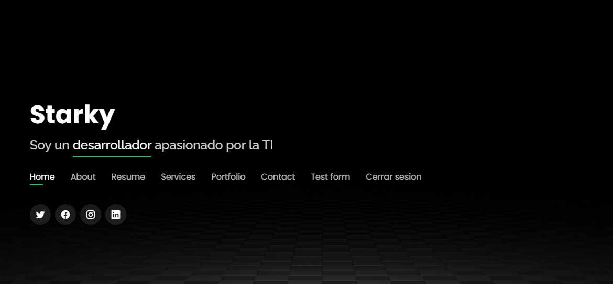
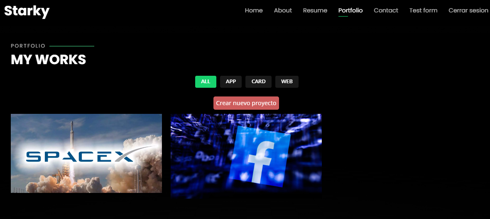

<h1 align="center">Proyecto Portafolio Personal</h1>

### En este proyecto se inicio inicialmente, aqui se encuentran todos los commits
### (actualizacion) Se subio a Railway
### Link de Railway
   - https://portafolio-production-66d6.up.railway.app/
   

### Cree otro repositorio con toda la documentacion paso a paso para poder correr el proyecto de manera local y un video en youtube
- https://github.com/starkymc/Portafolio-local-withoutrailway

## Youtube
[Youtube demo - Click aqui](https://www.youtube.com/watch?v=HJ986S9yxWo "link title")

  
### Rutas principales del proyeco:
    Inicio de sesion ("/")
    Registro ("/signup")
    Vista de la pagina principal ("/profile")
    Creacion de portafolio ("/crearportafolio")
    

### Screenshots

